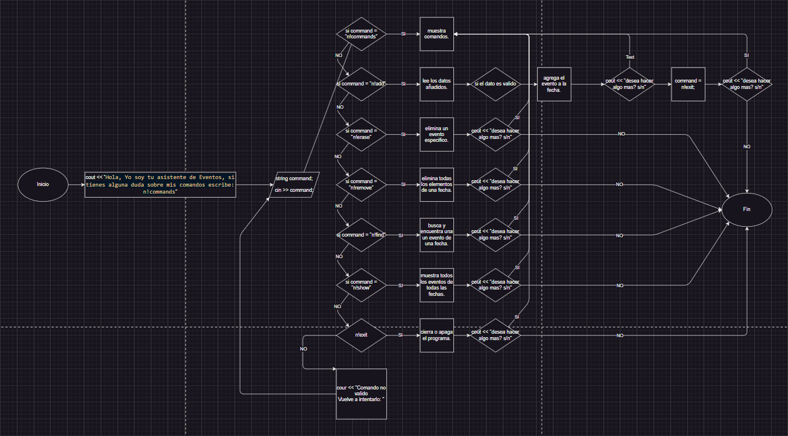

// El problema

Eres un desarrollador C++ en una empresa y se te ha solicitado crear un modelo de base de
datos simple. Pero antes te piden investigar sobre todas las bases de datos existentes y
hacer una comparativa para justificar esta implementacion.
Entonces, primero se debe realizar dicha comparativa estudiar las existentes y escribir una
justificacion del desarrollo de un nuevo manejador de base de datos.
Luego, es necesario analizar el problema y escribir un programa en C++ que implemente el
trabajo con una base de datos simple (abreviado «BD»). El programa se comunicará con el
usuario a través de la entrada y salida estándar (flujos stdin y stdout).
Almacenaremos en nuestra BD pares del tipo: fecha, evento. Definiremos la fecha como una
cadena en el formato Año-Mes-Día, donde Año, Mes y Día son números enteros.
Definiremos el evento como una cadena de caracteres imprimibles arbitrarios sin
separadores dentro (espacios, tabulaciones, etc.). Un evento no puede ser una cadena vacía.
En una misma fecha pueden ocurrir muchos eventos diferentes, la BD debe ser capaz de
almacenarlos todos. No es necesario guardar eventos idénticos que ocurran el mismo día:
basta con guardar solo uno de ellos.

// Explicacion de base de datos existentes, comparativa y justificacion de este nuevo desarrollo

Mi base de datos tiene la funcionalidad de almacenar, eventos en fechas espeficicas de los usuarios, permitiendoles tener un tiempo mas ordenado, a comparacion de las existentes, esta tiene un prototipo de una especie de asistente que en un futuro pueda tener mas funciones para la comodidad del usuario, un ejemplo seria la opcion de recibir una alerta cuando la fecha del evento este cerca.

// Estructura de repositorio

En el repositorio se encuentran las 3 partes fundamentales del codigo separados por modulacion y son:

- Cuerpo.cpp

- Llamada_de_Funcion.cpp

- Funcion.pp

Y como adicional el "a.exe" que es el ejecutable que es necesario para poder ejecutar el programa.

// Descripcion de las funciones, estructuras

- void show_commands();

- bool valid_data(const string& date);

- void add(const string& date, const string& event);

- void print();

- void delete_event(const string& date, const string& event);

- void remove_all(const string& date);

- void find(const string& date);

- void ask_for_action(string& command);

// Diagrama de flujos o Pseudocodigo.

// Creditos - Las personas que contribuyeron al proyecto

Estudiante: Eduardo Zurita Ferrufino

// Herramientas utilizadas

- Visual Studio Code

- Youtube

- Chrome

- ChatGPT

- Draw.io